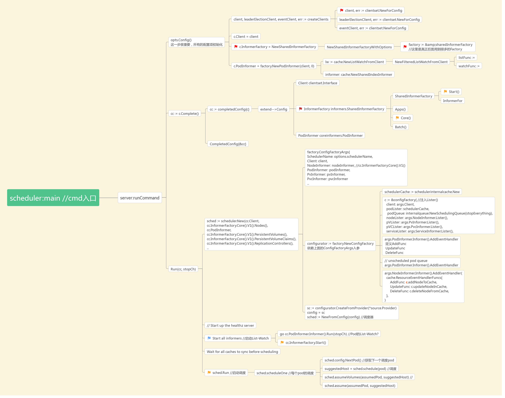

### List-Watch
1. 可以在API-Server中创建一种资源?(Pod/node/自定义) .CRD和其他的一样？
2. 使用API-server创建这种资源

3. 写对应的controller(controller-manager)
> 通过List-watch和Api-server建立监听关系,apiserver中有对应的创建、删除事件时，controller接受到事件
开始处理对应的事件。
> 如果需要生产对应的资源，怎么和kubelet通信？需要吗？

https://www.jianshu.com/p/234d27d5c1c1

https://www.jianshu.com/p/e9cb0118ec1e

https://www.jianshu.com/p/bf92a710f947

