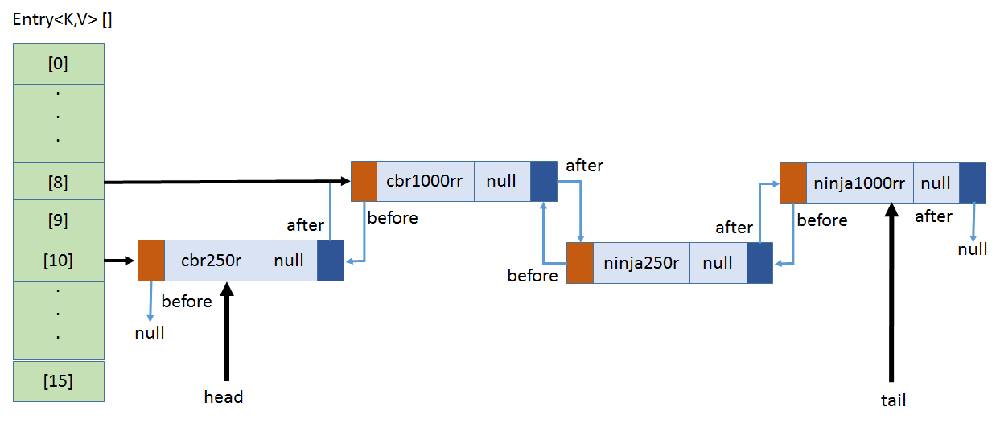

### hashmap & LinkedHashMap
* hashmap 使用数组+链表(红黑树)
* LinkedHashMap 每个节点组成一个双向链表。
> * 新建的node会添加在双向链表的尾部
> * accessOrder=true的话，获取一个node后，会将该node移到双向链表的尾部

### ConcurrentHashMap
* put
> * table为空，就初始化table
> * table[n]的节点(Node)为null，就放置新的节点(Node)
> * synchronized table[n]的节点(Node)
> > * 链表的话，放置在列表的最后
> > * 红黑树的话，放置到树中
