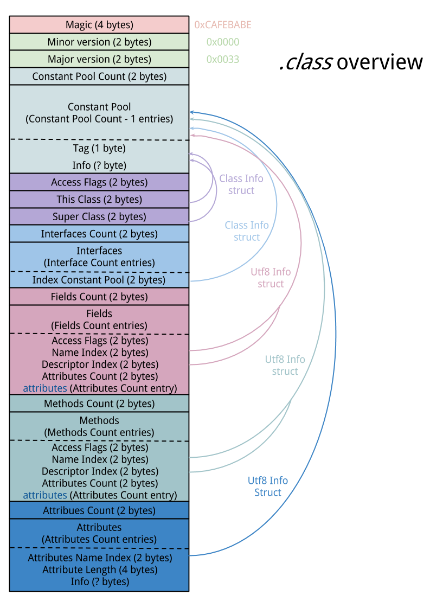

### 字节码
> 再次理解字节码

* 文件格式 [link](https://blog.lse.epita.fr/articles/69-0xcafebabe-java-class-file-format-an-overview.html)
* 常量池中到底有哪些数据
* field表
* method表
* atrribute表
> * 方法中的Code、Exception
> * final的常量值

| 类型 | 名称 | 含义 |
| --- | --- | --- |
| u4 | Magic | 0xCAFEBABE |
| u2 | Minor version | 小版本 |
| u2 | Major version | 主版本 |
| u2 | Constant Pool Count |  |
| Constant Pool Count -1 | Constant Pool  |  |
| u2 | Access Flags |  |
| u2 | This Class |  |
| u2 | Super Class |  |
| u2 | Interfaces Count |  |
| Interfaces Count | Interfaces |  |
| u2 | Fields Count |  |
| Fields Count | Fields |  |
| u2 | Methods Count |  |
| Methods Count | Methods |  |
| u2 | Attributes Count |  |
| Attributes Count | Attributes |  |

#### 字段表集合
| 类型 | 名称 | 数量 |
| --- | --- | --- |
| u2 | access_flogs | 1 |
| u2 | name_index | 1 |
| u2 | descriptor_index | 1 |
| u2 | attributes_count | 1 |
| u2 | attribute_info | attributes_count |

#####  访问标志(access_flogs)
| 名称 | 标志值 | 含义 |
| --- | --- | --- |
| ACC_PUBLIC | 0x0001 | 字段是否是public |
| ACC_PRIVATE | 0x0002 | 字段是否是private |
| ACC_PROTECTED| 0x0004 | 字段是否是protected |
| ACC_static| 0x0008 | 字段是否是static |
| ACC_final | 0x0010 | 字段是否是final |
| ACC_volatile| 0x0040 | 字段是否是volatile |
| ACC_transient| 0x0080 | 字段是否是transient |
| ACC_synthetic| 0x1000 | 是否是编译器自动产生 |
| ACC_enum| 0x4000 | 是否是enum |

#### 方法表集合
* 访问标志(access_flogs)
* 名称索引(name_index)
* 描述符索引(descriptor_index)
* 属性集合(attributes)

| 类型 | 名称 | 数量 |
| --- | --- | --- |
| u2 | access_flogs | 1 |
| u2 | name_index | 1 |
| u2 | descriptor_index | 1 |
| u2 | attributes_count | 1 |
| u2 | attribute_info | attributes_count |

#####  访问标志(access_flogs)
| 名称 | 标志值 | 含义 |
| --- | --- | --- |
| ACC_PUBLIC | 0x0001 | 方法是否是public |
| ACC_PRIVATE | 0x0002 | 方法是否是private |
| ACC_PROTECTED| 0x0004 | 方法是否是protected |
| ACC_static| 0x0008 | 方法是否是static |
| ACC_final | 0x0010 | 方法是否是final |
| ACC_synchronized | 0x0020 | 方法是否是synchronized |
| ACC_bridge| 0x0040 | 方法是否是编译器产生的桥接方法 |
| ACC_varargs| 0x0080 | 方法是否是接受可变不定参数 |
| ACC_native| 0x0100 | 方法是否是native |
| ACC_abstract| 0x0400 | 方法是否是abstract |
| ACC_strictfp| 0x0800 | 方法是否是strictfp |
| ACC_synthetic| 0x1000 | 方法是否是编译器自动产生 |

#### 属性表集合

| 属性名称 | 使用位置 | 含义 |
| --- | --- | --- |
| Code | 方法表 | 代码编译成的字节码指令 |
| ConstantValue | 字段表 | final定义的常量值 |
| Deprecated | 类、方法表、字段表 | 被声明为deprecated的方法或字段|
| Exceptions | 方法表 | 方法抛出的异常 |
| EnclosingMethod | 类文件 | 仅当一个类为局部类或匿名类时才能拥有这个属性，标识这个类所在的外围方法 |
| InnerClasses | 类文件 | 内部类列表 |
| LineNumberTable | Code 属性 | Java 源码的行号与字节码指令的对应关系 |
| LocalVariableTable | Code 属性 | 方法的局部变量描述 |
| StackMapTable | Code 属性 | JDK1.6新增。
