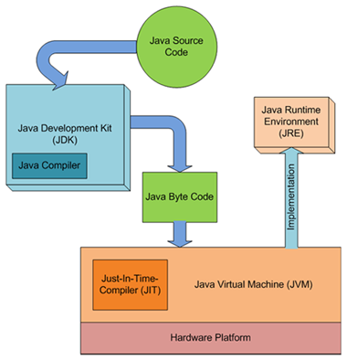

### jre
```shell
├── bin
│   ├── ControlPanel -> jcontrol
│   ├── java
│   ├── javaws
│   ├── jcontrol
│   ├── jjs
│   ├── keytool
│   ├── orbd
│   ├── pack200
│   ├── policytool
│   ├── rmid
│   ├── rmiregistry
│   ├── servertool
│   ├── tnameserv
│   └── unpack200
├── lib
│   ├── calendars.properties
│   ├── charsets.jar
│   ├── deploy.jar
│   ├── ext
│   │   ├── cldrdata.jar
│   │   ├── dnsns.jar
│   │   ├── jaccess.jar
│   │   ├── jfxrt.jar
│   │   ├── localedata.jar
│   │   ├── meta-index
│   │   ├── nashorn.jar
│   │   ├── sunec.jar
│   │   ├── sunjce_provider.jar
│   │   ├── sunpkcs11.jar
│   │   └── zipfs.jar
│   ├── javaws.jar
│   ├── jce.jar
│   ├── jexec
│   ├── jfr
│   │   ├── default.jfc
│   │   └── profile.jfc
│   ├── jfr.jar
│   ├── jfxswt.jar
│   ├── jsse.jar
│   ├── jvm.hprof.txt
│   ├── plugin.jar
│   ├── psfont.properties.ja
│   ├── psfontj2d.properties
│   ├── resources.jar
│   ├── rt.jar
```
### jdk
```shell
├── bin
│   ├── ControlPanel -> jcontrol
│   ├── appletviewer
│   ├── extcheck
│   ├── idlj
│   ├── jar
│   ├── jarsigner
│   ├── java
│   ├── java-rmi.cgi
│   ├── javac
│   ├── javadoc
│   ├── javafxpackager
│   ├── javah
│   ├── javap
│   ├── javapackager
│   ├── javaws
│   ├── jcmd
│   ├── jconsole
│   ├── jcontrol
│   ├── jdb
│   ├── jdeps
│   ├── jhat
│   ├── jinfo
│   ├── jjs
│   ├── jmap
│   ├── jmc
│   ├── jmc.ini
│   ├── jps
│   ├── jrunscript
│   ├── jsadebugd
│   ├── jstack
│   ├── jstat
│   ├── jstatd
│   ├── jvisualvm
│   ├── keytool
│   ├── native2ascii
│   ├── orbd
│   ├── pack200
│   ├── policytool
│   ├── rmic
│   ├── rmid
│   ├── rmiregistry
│   ├── schemagen
│   ├── serialver
│   ├── servertool
│   ├── tnameserv
│   ├── unpack200
│   ├── wsgen
│   ├── wsimport
│   └── xjc

```
